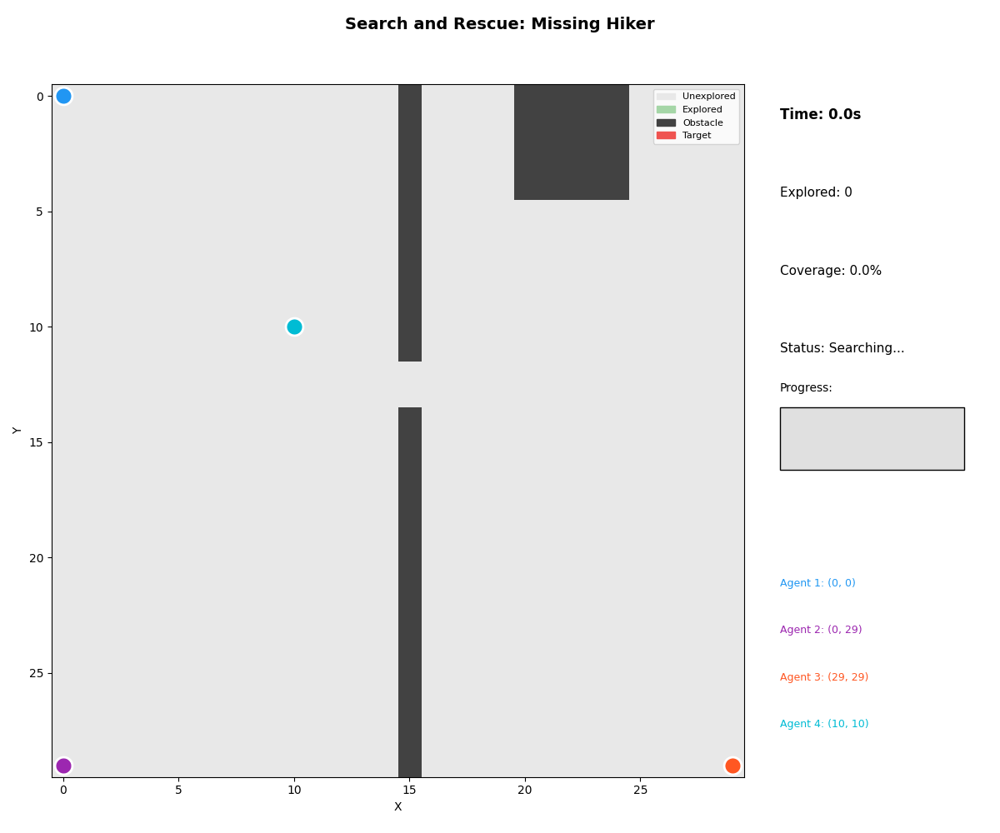

# Time-Constrained Multi-Agent Search with Online Strategy Selection via Stigmergic Coordination

[](https://www.python.org/downloads/)
[](https://opensource.org/licenses/MIT)

A framework for coordinating multiple autonomous agents to search for targets under hard time constraints, using online strategy selection and stigmergic (indirect) coordination.



## The Problem

How do you coordinate multiple searchers to find a target (lost keys, missing person, compromised server, misplaced inventory) when:
- You have a **hard deadline** (sunset, SLA, patient window)
- You don't know **which search strategy** works best for the terrain
- Agents can't communicate directly but need to **avoid redundant work**

## The Solution

**Spend time to save time.**

Our framework partitions the time budget:
- **20% Sampling Phase**: Benchmark different strategies on sample regions
- **80% Execution Phase**: Deploy agents with the winning strategy

Agents coordinate through **stigmergy**—leaving marks in the environment (like ant pheromone trails) rather than direct communication.

## Key Results

| Metric | Value |
|--------|-------|
| Success Rate | **88%** (vs 82% baseline) |
| Optimal Sampling Ratio | **20%** |
| Online vs Random Selection | **+58 percentage points** |
| Best Agent Count | **1-2** (coordination overhead beyond) |
| Experiments Run | **650+** |

## Features

- **12 Search Strategies**: 5 for 1D paths, 7 for 2D grids
- **Stigmergic Coordination**: Lock-free marking system for multi-agent sync
- **Online Strategy Selection**: Benchmark-based adaptation to unknown terrain
- **2D Grid Support**: Obstacles, hotzones, heterogeneous terrain
- **Animated Visualizations**: 20 GIF animations demonstrating the framework
- **6 Validated Use Cases**: SAR, cybersecurity, warehouse, drones, debugging, medical

## Installation

```bash
# Clone the repository
git clone https://github.com/yourusername/multi-agent-search.git
cd multi-agent-search

# Create virtual environment
python -m venv .venv
source .venv/bin/activate  # On Windows: .venv\Scripts\activate

# Install dependencies
pip install -r multi_agent_search/requirements.txt
```

### Requirements

```
numpy>=1.20.0
matplotlib>=3.5.0
pillow>=9.0.0
```

## Quick Start

### Run a Basic Simulation

```python
from multi_agent_search.src.core.cell import Path
from multi_agent_search.src.core.marking_system import MarkingSystem
from multi_agent_search.src.core.searcher import Searcher
from multi_agent_search.src.strategies.greedy_nearest import GreedyNearestStrategy
from multi_agent_search.src.engine.orchestrator import SearchOrchestrator

# Create a path with 50 cells
path = Path.generate(length=50, key_position=35)

# Run the orchestrator
orchestrator = SearchOrchestrator(
    path=path,
    num_searchers=3,
    time_budget=60.0,
    sampling_ratio=0.2
)

results = orchestrator.run()
print(f"Success: {results['success']}")
print(f"Time remaining: {results['time_remaining']:.1f}s")
```

### Run 2D Grid Search

```python
from multi_agent_search.src.core.grid import Grid2D, GridAgent, MovementType
from multi_agent_search.src.strategies.grid_strategies import SwarmStrategy
from multi_agent_search.src.visualization.grid_animator import run_grid_simulation

# Create 20x20 grid with 8-way movement
grid = Grid2D(20, 20, MovementType.EIGHT_WAY)
grid.add_obstacles(density=0.1)
grid.place_target((15, 15))

# Create agents with swarm coordination
agents = [GridAgent(i, start_position=(0, i*5)) for i in range(4)]
strategies = [SwarmStrategy(repulsion_strength=2.0) for _ in range(4)]

# Run simulation
frames, found, elapsed = run_grid_simulation(grid, agents, strategies, time_budget=60.0)
print(f"Found: {found} in {elapsed:.1f}s")
```

### Generate Animations

```bash
# 1D path animations
python multi_agent_search/examples/create_animations.py

# 2D grid animations
python multi_agent_search/examples/create_2d_animations.py

# Use case demonstrations
python multi_agent_search/examples/explore_use_cases.py
```

### Run Experiments

```bash
# Full experiment suite (650+ runs)
python multi_agent_search/examples/run_experiments.py

# File system search simulation
python multi_agent_search/examples/run_file_search.py
```

## Project Structure

```
├── multi_agent_search/
│   ├── src/
│   │   ├── core/
│   │   │   ├── cell.py              # Cell, Path, CellStatus
│   │   │   ├── grid.py              # 2D Grid, GridAgent
│   │   │   ├── marking_system.py    # Stigmergic marking
│   │   │   ├── searcher.py          # Searcher agent
│   │   │   └── time_manager.py      # Time budget management
│   │   ├── strategies/
│   │   │   ├── base.py              # Abstract strategy
│   │   │   ├── greedy_nearest.py    # Nearest unmarked cell
│   │   │   ├── territorial.py       # Segment-based division
│   │   │   ├── probabilistic.py     # Probability-weighted
│   │   │   ├── contrarian.py        # Maximize agent separation
│   │   │   ├── random_walk.py       # Random baseline
│   │   │   └── grid_strategies.py   # 2D: Spiral, Quadrant, Swarm, etc.
│   │   ├── engine/
│   │   │   ├── benchmark.py         # Strategy benchmarking
│   │   │   ├── selector.py          # Online strategy selection
│   │   │   ├── orchestrator.py      # Main controller
│   │   │   └── simulation.py        # Simulation loop
│   │   ├── visualization/
│   │   │   ├── animator.py          # 1D path animation
│   │   │   └── grid_animator.py     # 2D grid animation
│   │   ├── research/
│   │   │   ├── metrics.py           # MetricsCollector
│   │   │   ├── experiments.py       # ExperimentRunner
│   │   │   └── plotting.py          # Publication figures
│   │   └── scenarios/
│   │       └── file_system_search.py # Realistic file search
│   ├── examples/
│   │   ├── run_simulation.py
│   │   ├── run_experiments.py
│   │   ├── create_animations.py
│   │   ├── create_2d_animations.py
│   │   └── explore_use_cases.py
│   ├── animations/                   # Generated GIFs (20 files)
│   ├── figures/                      # Publication figures
│   ├── results/                      # Experiment data
│   └── tests/
│       └── test_basic.py
├── paper/
│   ├── main.tex                      # LaTeX paper
│   └── references.bib
└── README.md
```

## Strategies

### 1D Path Strategies

| Strategy | Description | Best For |
|----------|-------------|----------|
| **Greedy Nearest** | Always move to closest unmarked cell | General purpose, fast convergence |
| **Territorial** | Divide path into segments per agent | Known agent count, uniform terrain |
| **Probabilistic** | Weight by prior probability | When prior knowledge exists |
| **Contrarian** | Maximize distance from other agents | Reducing redundant coverage |
| **Random Walk** | Random unmarked cell selection | Baseline comparison |

### 2D Grid Strategies

| Strategy | Description | Best For |
|----------|-------------|----------|
| **Spiral** | Expand outward from start | Target likely near starting point |
| **Greedy** | Nearest unexplored cell | General exploration |
| **Quadrant** | Divide grid into zones | Multi-agent coverage |
| **Probabilistic** | Prioritize high-probability cells | Hotzone exploitation |
| **Swarm** | Repulsion-based coordination | Maximizing spread |
| **Wavefront** | BFS-like systematic expansion | Complete coverage guarantee |
| **Random** | Random neighbor selection | Baseline |

## Use Cases

We validated the framework across 6 application domains:

### 1. Search and Rescue (SAR)
- **Scenario**: Missing hiker in wilderness
- **Agents**: Ground teams, K9 unit, helicopter
- **Result**: Found in 48.2s

### 2. Network Threat Hunting
- **Scenario**: Compromised node detection
- **Agents**: Vulnerability scanner, EDR, SIEM
- **Result**: Threat identified in 38.3s

### 3. Warehouse Inventory
- **Scenario**: Misplaced high-value item
- **Agents**: 6 warehouse robots
- **Result**: Located in 37.0s

### 4. Drone Swarm Surveillance
- **Scenario**: Agricultural anomaly detection
- **Agents**: Visual, thermal, LIDAR, multispectral drones
- **Result**: Anomaly detected in 64.8s

### 5. Distributed Debugging
- **Scenario**: Root cause in distributed system
- **Agents**: Log analyzer, profiler, tracer, static analyzer
- **Result**: Bug found in 19.1s

### 6. Medical Diagnosis
- **Scenario**: Emergency differential diagnosis
- **Agents**: Blood panel, imaging, physical exam, specialist
- **Result**: Diagnosis confirmed in 16.4s

## Animations

### 1D Path Search
| Animation | Description |
|-----------|-------------|
| `anim_single_searcher.gif` | Single agent greedy search |
| `anim_territorial.gif` | 3 agents with territory division |
| `anim_probabilistic.gif` | Probability-weighted search |
| `anim_random_walk.gif` | Random baseline |
| `anim_large_scale.gif` | 5 agents on 50-cell path |

### 2D Grid Search
| Animation | Description |
|-----------|-------------|
| `grid_simple.gif` | Basic greedy exploration |
| `grid_spiral.gif` | Spiral pattern from center |
| `grid_maze.gif` | Maze navigation |
| `grid_multi_agent.gif` | 4-agent quadrant search |
| `grid_swarm.gif` | Swarm coordination |
| `grid_warehouse.gif` | Room structure |
| `grid_probabilistic.gif` | Hotzone prioritization |
| `grid_large_scale_success.gif` | 40x40, 8 agents |

### Use Case Demos
| Animation | Description |
|-----------|-------------|
| `usecase_sar.gif` | Search and Rescue |
| `usecase_threat_hunting.gif` | Network Security |
| `usecase_warehouse_fixed.gif` | Warehouse Search |
| `usecase_drone_swarm.gif` | Drone Surveillance |
| `usecase_debugging_fixed.gif` | Code Debugging |
| `usecase_medical.gif` | Medical Diagnosis |

## Theoretical Results

### Optimal Sampling Ratio
Under uniform target distribution and homogeneous terrain:

$$\alpha^* = \frac{1}{1 + \sqrt{T \cdot \bar{\theta}}}$$

For T=60s and mean throughput θ̄=1 cell/s, this gives α* ≈ 11.4%. Our experiments found 20% optimal in practice due to strategy variance.

### Coordination Overhead
Effective throughput with m searchers:

$$\Theta_{effective} = m \cdot \theta \cdot \left(1 - \frac{t_r}{t_r + \bar{\tau}}\right) \cdot \left(1 - \frac{m-1}{2n}\right)$$

This explains why performance degrades beyond 2 agents in our experiments.

## Citation

```bibtex
@article{dube2026multiagentsearch,
  title={Time-Constrained Multi-Agent Search with Online Strategy Selection via Stigmergic Coordination},
  author={Dube, Xolani},
  year={2026},
  journal={GitHub Repository},
  url={https://github.com/xolanidube/multi-agent-search}
}
```

## Contributing

Contributions are welcome! Please feel free to submit a Pull Request. For major changes, please open an issue first to discuss what you would like to change.

1. Fork the repository
2. Create your feature branch (`git checkout -b feature/AmazingFeature`)
3. Commit your changes (`git commit -m 'Add some AmazingFeature'`)
4. Push to the branch (`git push origin feature/AmazingFeature`)
5. Open a Pull Request

## License

This project is licensed under the MIT License - see the [LICENSE](LICENSE) file for details.

## Acknowledgments

- Inspired by stigmergic coordination in ant colonies
- Search theory foundations from Beck & Bellman's linear search problem
- Algorithm selection theory from Rice (1976)

## Contact

- **Author**: Xolani Dube
- **Email**: i@xolani.co.za
- **LinkedIn**: [Xolani Dube](https://www.linkedin.com/in/xolani-dube-b22333141/)
- **GitHub**: [@xolanidube](https://github.com/xolanidube)

---

**Star ⭐ this repo if you find it useful!**
